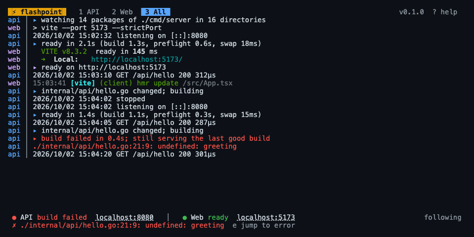

# flashpoint

Hot reload for a **Go HTTP server with a Vite/React front end**: one command, one Ctrl-C, and no dropped requests.

```
cd my-app && flashpoint
```

flashpoint finds your `main` package and your Vite app, runs both, and rebuilds the Go server when you save. The old server keeps serving while the new one builds. flashpoint holds the listening socket for the whole session, so during the swap requests wait in the kernel's queue instead of failing. A broken build leaves the last good one running. Vite keeps doing its own HMR beside it.



## Install

```
brew install danielloader/tap/flashpoint
```

or

```
go install github.com/danielloader/flashpoint/cmd/flashpoint@latest
```

Prebuilt binaries for macOS and Linux (amd64 and arm64) are on the [releases page](https://github.com/danielloader/flashpoint/releases). Windows is not supported yet, because the child supervision relies on Unix process groups and signals.

## Quick start

1. **Hand the server flashpoint's socket.** This is optional, but it is what makes restarts refuse no connections:

   ```go
   import "github.com/danielloader/flashpoint/listen"

   ln, err := listen.Listen(":" + os.Getenv("PORT"))
   if err != nil {
       log.Fatal(err)
   }
   http.Serve(ln, mux)
   ```

   Outside flashpoint, `listen.Listen` is `net.Listen("tcp", addr)`, so the code can stay in for production. Without the helper, flashpoint still works. It restarts the server normally, and connections are refused for the few milliseconds the server takes to bind its port.

2. **Point Vite's proxy at the API.** This is one line in `vite.config.ts`:

   ```ts
   server: {
     proxy: { "/api": process.env.FLASHPOINT_API_URL ?? "http://127.0.0.1:8080" },
   },
   ```

3. **Run `flashpoint`** from anywhere in the project.

[`examples/basic`](examples/basic) is a complete minimal project: a Go JSON API and a Vite React page. To try it:

```
cd examples/basic/web && npm install && cd .. && flashpoint
```

### Browser reload after an API swap (optional)

With the socket handoff the page never notices a restart, and usually that is what you want. If you would rather have the page reload whenever a new API build goes live, copy [`flashpoint-reload.ts`](examples/basic/web/flashpoint-reload.ts) (about 20 lines) next to your `vite.config.ts` and add it to `plugins`:

```ts
import flashpointReload from "./flashpoint-reload.ts";

export default defineConfig({ plugins: [react(), flashpointReload()] });
```

flashpoint touches the file named in `FLASHPOINT_RELOAD_FILE` after each swap. The plugin watches that file and sends Vite's `full-reload`.

## What it detects

| | how |
|---|---|
| project root | the nearest directory at or above the current one with `flashpoint.toml` or `go.mod` |
| main package | the root package if it is `main`, otherwise the only `main` under `./cmd/...`, otherwise the only one in the module. If there are several, flashpoint lists them and asks for `--main`. |
| Vite app | the first of `.`, `web/`, `frontend/`, `ui/` and `client/` with a `vite.config.*` |
| package manager | `packageManager` in package.json, otherwise the nearest lockfile (`pnpm-lock.yaml`, `yarn.lock`, `bun.lock(b)`, `package-lock.json`), otherwise npm |
| dev command | `<pm> run dev`. When the script is plain `vite`, flashpoint adds `--port N --strictPort`. Otherwise it exports the port as `FLASHPOINT_WEB_PORT` and leaves the script alone. |

## Ports, and running checkouts side by side

The API defaults to port 8080 and the web app to 5173. Each can be set with a flag, an environment variable or the config file, in that order of precedence:

```
flashpoint --api-port 8091 --web-port 5191
FLASHPOINT_API_PORT=8091 FLASHPOINT_WEB_PORT=5191 flashpoint
```

Port `0` picks a free port. Two worktrees can run at once, each with its own pair.

If a port is taken, flashpoint says who holds it (via `lsof`, when it is installed) and exits with code 3. **It never kills the holder**, which might be your other checkout.

## The TUI

On a terminal, flashpoint shows tabs for the **API** logs, the **Web** logs and **All** of them interleaved and labelled. Below the logs is a status bar:

- **API**: ● building (amber, showing elapsed time), ● ready (green, with "rebuilt in 1.4s"), or ● build failed / crashed / offline (red). A failed build also shows the first compiler error, and `e` jumps to it.
- **Web**: ● starting, ● ready or ● down.
- **The URLs** of the API and the web app, as OSC 8 hyperlinks. Click one, or press `o`.

| key | |
|---|---|
| `1` `2` `3`, `tab` | API, Web and All (or click a tab) |
| `↑` `↓` `pgup` `pgdn` `g` `G` | scroll; `G` returns to follow mode (the mouse wheel also scrolls) |
| `/` | filter lines (`esc` clears the filter) |
| `c` | clear the current tab |
| `e` | jump to the last build error |
| `r` | rebuild and restart the API now |
| `w` | restart the web dev server |
| `o` / `O` | open the web app / open the API |
| `m` | turn mouse capture on or off (off lets the terminal select text) |
| `q`, `ctrl+c` | stop everything and quit; pressing again leaves immediately |
| `?` | help |

## Plain mode

`--no-tui` prints labelled lines. It is also the default when stdout or stdin is not a terminal, when `CI` is set, or when `TERM=dumb`. This suits agents and CI logs:

```
flashpoint ▸ api http://localhost:8080 · web http://localhost:5173
api ▸ watching 2 packages of . in 3 directories
api │ 2026/10/02 15:01:06 listening on [::]:8080
api ▸ ready in 658ms (build 343ms, preflight 295ms, swap 16ms)
web │   VITE v8.3.2  ready in 733 ms
web ▸ ready on http://localhost:5173
api ▸ main.go changed; building
api ▸ build failed in 103ms; still serving the last good build
api │ ./main.go:20:6: syntax error: unexpected name main, expected (
api ▸ main.go changed; building
api ▸ ready in 1.3s (build 752ms, preflight 509ms, swap 15ms)
```

Colour is used only on a terminal, and `NO_COLOR` turns it off.

## Configuration

Everything is optional. Put a `flashpoint.toml` at the project root, and unknown keys are rejected so a typo is caught.

```toml
[api]
main = "./cmd/server"        # main package to build
port = 8080                  # 0 picks a free port
host = ""                    # address to bind; empty means all interfaces
build_flags = ["-tags=dev"]  # added after flashpoint's own
args = ["-v"]                # passed to the server (or: flashpoint -- -v)
env = { LOG_LEVEL = "debug" }
health = "/healthz"          # polled until it answers below 500; default "/"
port_env = "PORT"            # variable that carries the port to the server
stop_signal = "SIGINT"       # sent to stop the old server
stop_timeout = "10s"         # then SIGKILL

[web]
enabled = true
dir = "frontend"
command = "pnpm dev --port {port}"   # replaces the detected command; runs under sh -c
port = 5173
env = { VITE_FLAG = "1" }

[watch]
enabled = true                                      # false: rebuild only on request
include = ["config/**/*.yaml", "migrations/*.sql"]  # extra files that rebuild the API
exclude = ["internal/gen/**"]                       # never rebuild for these
debounce = "150ms"

[logs]                       # paths are relative to the project root
dir = ".flashpoint/logs"     # api.log, web.log, flashpoint.log and all.log
api = ""                     # or name any stream's file on its own
web = ""
flashpoint = ""
all = ""
timestamps = true            # RFC 3339 prefix on each line
truncate = false             # append, with a session header
max_size = "10MB"            # then rotate to .1
```

`{port}` and `{api_url}` are replaced in `web.command`.

### Environment flashpoint sets

| variable | set for | value |
|---|---|---|
| `PORT` (or `api.port_env`) | API | the API port |
| `LISTEN_FDS=1`, `LISTEN_FDNAMES=flashpoint` | API | the socket is fd 3; used by `listen.Listen` |
| `FLASHPOINT=1` | both | |
| `FLASHPOINT_API_URL` | both | `http://127.0.0.1:<api port>`, for the Vite proxy |
| `FLASHPOINT_WEB_URL` | API | `http://localhost:<web port>` |
| `FLASHPOINT_WEB_PORT` | web | the web port |
| `FLASHPOINT_RELOAD_FILE` | web | touched after each API swap |

### Flags

```
flashpoint [flags] [-- server args]
  -C dir                 run in dir
  --main pkg             main package to build
  --api-port N           API port
  --web-port N           web port
  --web-dir dir          the Vite app's directory
  --no-web               run the API only
  --no-tui               plain output
  --watch=false          rebuild only on SIGUSR1 or `flashpoint reload`
  --log-dir dir          api.log, web.log, flashpoint.log, all.log
  --log-api|--log-web|--log-flashpoint|--log-all path
  --log-timestamps=false
  --log-truncate
  --log-max-size 10MB
  --version

flashpoint reload [--wait] [--timeout 60s] [--web] [-C dir]
flashpoint logs api|web|flashpoint|all [-n 100] [--since-build] [-C dir]
```

### Exit codes

| code | meaning |
|---|---|
| 0 | stopped cleanly (`q`, Ctrl-C, SIGTERM or SIGHUP) |
| 1 | could not start: no `go.mod`, no main package, a bad `package.json`, and similar |
| 2 | bad flags or a bad `flashpoint.toml` |
| 3 | a port is already in use |

`flashpoint reload` and `flashpoint logs` exit with 0 on success, 1 when the build failed or the API did not come up, 4 when no flashpoint is running for the project, and 124 when `--timeout` runs out.

## Driving flashpoint from an agent or script

By default flashpoint rebuilds on every save. An agent that edits several files in a row may prefer to say when: run with `--watch=false` (or `watch.enabled = false`) and trigger rebuilds yourself. The triggers also work with watching on.

| | |
|---|---|
| `kill -USR1 $(cat .flashpoint/pid)` | fire and forget; no dependencies |
| `flashpoint reload` | the same, from the CLI |
| `flashpoint reload --wait` | blocks until the build is done: exit 0 once the new API answers, 1 with the compiler errors on stderr if it failed |
| `curl --unix-socket .flashpoint/ctl -X POST 'http://flashpoint/reload?wait=1'` | the same over HTTP: `200 {"ok":true,"buildMs":812,…}`, or `422` with `"errors": [...]` |

A rebuild on request takes the same path as a save: the old server keeps serving while the new one builds, and the swap uses the held socket. The log says why each build ran: `reload requested (signal)` or `(cli)`. `SIGUSR2` (or `flashpoint reload --web`) restarts the web dev server. `SIGHUP` still means quit, because closing a terminal sends it.

flashpoint keeps its per-project state in `.flashpoint/` at the project root. That directory holds `pid`, the control socket `ctl`, and log files if you ask for them, plus a `.gitignore` of its own so you never commit it. The watcher ignores it. The control socket is a unix socket (mode 0600) that speaks plain HTTP:

| | |
|---|---|
| `POST /reload[?wait=1]` | rebuild; with `wait`, 200 when ready, 422 on a build failure |
| `POST /restart-web` | restart the dev server |
| `GET /status` | the API and web states, the URLs, the last build and ready times, the log paths |
| `GET /logs/{api,web,flashpoint,all}?n=100&since_build=1` | the tail of a stream (also `flashpoint logs`) |

There is no TCP control port for now. An opt-in `--control-addr` with a token, for containers, could come later.

### One log file per stream

`--log-dir .flashpoint/logs` is the recommended setup for agents. It writes `api.log` (the server's output), `web.log` (Vite's), `flashpoint.log` (builds, restarts, reloads and compiler errors) and `all.log` (all of them, labelled). Each line gets a timestamp and has its colours stripped (the terminal keeps them). Each file is flushed per line, so `tail -f` is live. Every build is bracketed in `api.log` and `flashpoint.log`:

```
2026-10-02T15:04:02.113+01:00 --- build #12 started (cli)
2026-10-02T15:04:02.508+01:00 ./internal/api/hello.go:21:9: undefined: greeting
2026-10-02T15:04:02.508+01:00 --- build #12 failed in 395ms
```

So `flashpoint logs api --since-build` (or a `grep` from the last marker) shows only what the last build did. The files are written in TUI and plain mode alike. A write error is reported once, and it never blocks a child. If the disk falls behind, lines are dropped and counted.

```
flashpoint --watch=false --log-dir .flashpoint/logs
# … edit …
flashpoint reload --wait && tail -n 50 .flashpoint/logs/api.log
```

### With Claude Code

This hook in `.claude/settings.json` rebuilds after every edit. When the build fails, the compiler errors go back to Claude: exit code 2 feeds a PostToolUse hook's stderr to the model. When flashpoint isn't running, the hook stays quiet.

```json
{
  "hooks": {
    "PostToolUse": [
      {
        "matcher": "Edit|MultiEdit|Write",
        "hooks": [
          {
            "type": "command",
            "command": "flashpoint reload --wait --timeout 90s >/dev/null; rc=$?; [ $rc -eq 1 ] && exit 2; exit 0"
          }
        ]
      }
    ]
  }
}
```

If you'd rather not use a hook, end the agent's edit step with `flashpoint reload --wait`, and read `flashpoint logs api -n 50` when it fails.

## Why it's fast

The design comes from replacing air in a large Go + React project: about 600 packages in the build graph and a 61 MB server binary, on an M-series Mac. Every edit there cost 6–8 seconds, and through Vite's proxy about 4 seconds of requests failed with 502s. Here is what fixed it.

**The socket outlives the server.** flashpoint binds the API port once and passes it to each build as fd 3 (the systemd socket-activation convention). While the old process drains and the new one starts, connections queue in the kernel backlog instead of being refused. Through Vite's proxy, a 20 Hz prober saw **0 failed requests per save** (before: 57–79 of about 100). The slowest proxied request during a swap took 0.08–0.46s. In this repo's end-to-end test, four clients hammer the API through two swaps and a broken build, and none fails.

**Build first, then swap.** The old server keeps serving during `go build`. A failed build changes nothing, and the error goes to the log and the status bar. If no server is running at all (the first build failed, or the server crashed), flashpoint answers on the socket with a `503` that carries the compiler output, so requests do not hang.

**Watch exactly what the build reads.** The watch set is `go list -deps` for the main package: the Go, cgo and `go:embed` files of every package from your module, a workspace module or a local `replace`, plus `go.mod`, `go.sum` and `go.work`. Tests, the module cache, `node_modules` and your front end are not in it, so there are no globs to keep up to date. A new `.go` file in a watched package counts as a change, and the list is refreshed after every build, so a new import or embed is picked up. Events come from fsnotify with a trailing 150 ms debounce: a burst of saves is one build, however long it lasts.

**Skip restarts that change nothing.** When the new binary is byte-identical to the running one, flashpoint does not restart it. That covers a file rewritten with the same content (a formatter, a branch switch) and a comment-only edit outside the main package. An edit to the main package changes the binary's embedded build ID, so it restarts.

**Absorb macOS's first-run check.** macOS assesses every never-run executable on its first exec, which measured 0.35–1.0s depending on binary size (the second exec took 0.03s). flashpoint runs each new build once with `FLASHPOINT_PREFLIGHT=1` while the old server still serves, and `listen`'s `init` exits immediately in that mode. The cost moves out of the downtime window. To remove it entirely, add your terminal under System Settings → Privacy & Security → Developer Tools.

**Fast dev build flags.** flashpoint builds with `-buildvcs=false -ldflags=-w` (no VCS stamp, no DWARF). In 10 interleaved rounds of a handler edit, the median edit-to-binary time was:

| flags | edit → binary |
|---|---|
| default | 1.79s |
| `-buildvcs=false` | 1.77s |
| `-ldflags=-w` | 1.52s |
| `-buildvcs=false -ldflags=-w` | **1.30s** |

`-trimpath` is deliberately left out, so stack traces keep real, clickable paths and the build cache stays shared with your `go test` runs.

**Probing is cheap and bounded.** The readiness check after a swap uses one HTTP client with keep-alive. It polls from 20 ms up to 250 ms, with a 60 s deadline, and drops its connection once the server answers. The web check dials until Vite's port accepts, backing off to 1 s, and then stops: Vite's exit is what marks it down. Nothing polls while the stack is idle. `GET /status` reports `probeDials`. The tests assert that it stays at 0 over 10 idle seconds and opens at most 2 connections per restart.

**Nothing is left behind.** Each child runs under a small shim (flashpoint re-executed) in its own process group. The shim holds a pipe from flashpoint, and when the pipe closes it stops the whole group: npm, the shell it spawns, and node. It closes when flashpoint quits, and also when flashpoint is killed with `kill -9`. There are no orphans holding ports, and no `kill-port` scripts. Your server and Vite need no cooperation for this.

Overall, a Go handler edit went from 6.6–8.0s to **2.4–2.7s** until the API was ready again, with no failed requests. Idle CPU for the whole stack stayed around 0.02% of one core.

Those numbers were measured against air v1.62.0, configured with `delay = 2000` and `kill_delay = "2s"`. Air tuned down to a 150 ms delay and a 300 ms kill delay measured 3.6–5s per save, with about 2s of 502s. Current air builds before stopping the old process on macOS and Linux (see below).

## Compared with other tools

Each of these is a good tool. flashpoint is narrower: it covers only the Go API + Vite pair, and it handles the parts of that pairing the others leave to you. The table reflects each project's README and source on 2026-10-02.

| | flashpoint | [air](https://github.com/air-verse/air) | [wgo](https://github.com/bokwoon95/wgo) | [gow](https://github.com/mitranim/gow) | [watchexec](https://github.com/watchexec/watchexec) |
|---|---|---|---|---|---|
| language | Go | Go | Go | Go | Rust |
| watch set | derived from `go list -deps` | extensions, dirs and regexes in `.air.toml` | `-file`/`-dir` regexes (`.go` by default for `wgo run`) | `-w` dirs and `-e` extensions (default `go,mod`) | paths, extensions and filters; honours `.gitignore` |
| change batching | trailing debounce, 150 ms | fixed `delay` after the first event, then a flush ([engine.go]) | trailing debounce, 300 ms | none found | `--debounce`, 50 ms |
| old server during the build | keeps serving | keeps serving on macOS and Linux; stopped first on Windows ([engine.go]) | stopped, then rebuilt and rerun ([wgo_cmd.go]) | signalled, then `go run` again ([gow_cmd.go]) | not a build tool; `--restart` stops the command and runs it again |
| socket held across restarts | yes (fd 3, `listen` helper) | no | no | no | yes, `--socket` (the systemd protocol, as with systemfd) |
| skips a byte-identical binary | yes | no | no | no | n/a |
| runs Vite beside the API | yes, labelled, one Ctrl-C | no (`[[build.rules]]` run commands on change) | yes, `:: wgo …` runs parallel watchers | run several instances | one command per instance |
| browser reload | optional Vite plugin | `[proxy]` injects a script into HTML responses | no | no | no |
| children's process group | own group via a shim; cleaned up even if flashpoint is SIGKILLed | own group, signalled on stop ([util_linux.go]) | own group, SIGTERM on stop ([util_unix.go]) | finds descendants with `ps` instead of groups | group (or session on macOS) by default; `--stdin-quit` exits when stdin closes |
| UI | TUI (tabs, filter, status, links) or plain | log output | log output | hotkeys in raw mode | `--interactive` keys |
| licence | MIT | GPL-3.0 | MIT | Unlicense | Apache-2.0 |

What happens to each tool's children when the tool itself is SIGKILLed is not documented for air, wgo, gow or watchexec, so the table does not claim it.

Choose air if you want one mature tool for any Go project with proxy-based live reload. Choose wgo or gow for something minimal. Choose watchexec for a general-purpose watcher (with systemfd-style sockets) in any language.

[engine.go]: https://github.com/air-verse/air/blob/master/runner/engine.go
[util_linux.go]: https://github.com/air-verse/air/blob/master/runner/util_linux.go
[wgo_cmd.go]: https://github.com/bokwoon95/wgo/blob/main/wgo_cmd.go
[util_unix.go]: https://github.com/bokwoon95/wgo/blob/main/util_unix.go
[gow_cmd.go]: https://github.com/mitranim/gow/blob/master/gow_cmd.go

## Caveats

- **macOS and Linux only.**
- **Drain before exiting.** flashpoint stops the old server with SIGINT and waits for it. `http.Server.Serve` returns as soon as `Shutdown` begins, so a `main` that returns at that point cuts off requests still in flight. Wait for `Shutdown` to finish, as [`examples/basic`](examples/basic/main.go) does.
- **State held in memory is lost on each restart**, like any restart-based reloader.
- **The preflight relies on init order.** It exits from `listen`'s `init`. Go runs the inits of a package's dependencies first, so a package that does heavy work in its own `init` (such as opening a database) and does not import `listen` may run before it. Keep that work in `main`.
- **flashpoint needs `go` on `PATH`**, plus your package manager when there is a web app.

## Releasing

Push a `v*` tag. The Release workflow runs goreleaser, which publishes the archives and updates `Formula/flashpoint.rb` in [danielloader/homebrew-tap](https://github.com/danielloader/homebrew-tap). The tap step needs the `HOMEBREW_TAP_TOKEN` secret, and goreleaser skips that step when the secret is unset. Published assets are never replaced: every release is a new tag.

## Licence

[MIT](LICENSE)
